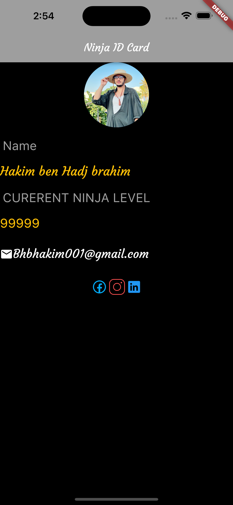

# Flutter Ninja ID Card

This Flutter project creates a Ninja ID card using various Flutter widgets and features. The project utilizes row and column layouts, SVG icons, CircleAvatar widget, image imports, and custom fonts.



## Features

- Displays a Ninja ID card with the following information:
  - Name
  - Rank
  - Mail

## Getting Started

### Prerequisites

Before running the project, ensure that you have Flutter installed on your development machine. If you haven't installed Flutter yet, please follow the official installation guide: [Install Flutter](https://flutter.dev/docs/get-started/install)

### Installation

1. Clone the repository:

   ```shell
   git clone https://github.com/hakimbhb/flutter-ninja-id-card.git


### Acknowledgements
Feel free to modify and customize the README file according to your project's specific details and needs.
# flutter-ninja-id-card
# flutter-ninja-id-card
# flutter-ninja-id-card
